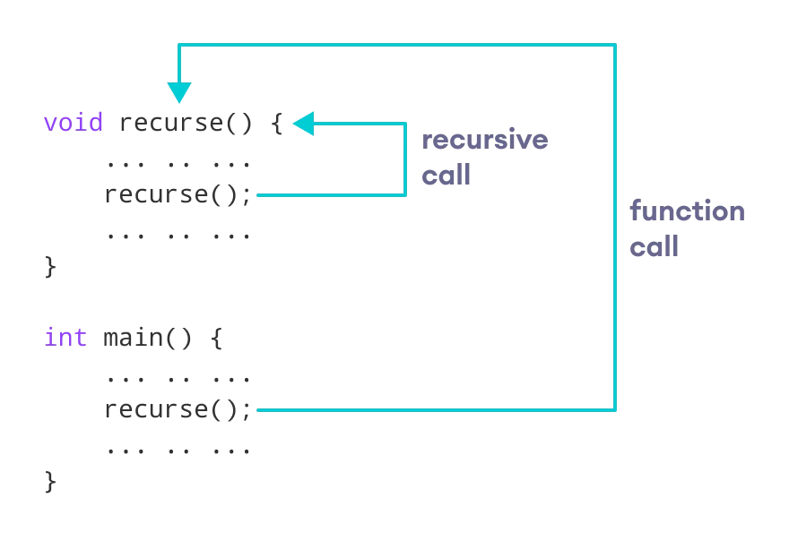
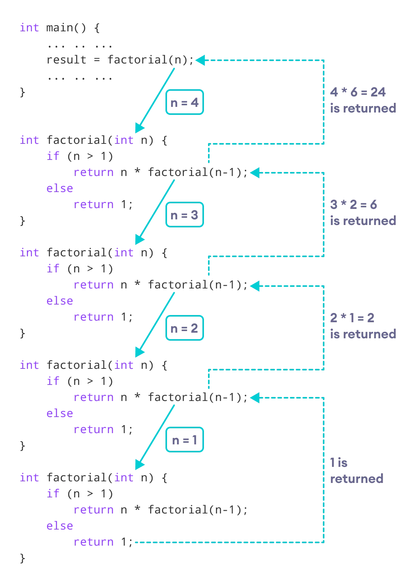

# Recursion

## Definition : 

The process in which a function calls itself directly or indirectly is called recursion and the corresponding function is called as recursive function. Using recursive algorithm, certain problems can be solved quite easily.

## Working of Recurion in c++


```c++
void recurse()
{
    ... .. ...
    recurse();
    ... .. ...
}

int main()
{
    ... .. ...
    recurse();s
    ... .. ...
}
```

The below figure show how to recursion work 




### Example 1. find Factorial
```c++
// Factorial of n = 1*2*3*...*n

#include <iostream>
using namespace std;

int factorial(int);

int main() {
    int n, result;

    cout << "Enter a non-negative number: ";
    cin >> n;

    result = factorial(n);
    cout << "Factorial of " << n << " = " << result;
    return 0;
}

int factorial(int n) {
    if (n > 1) {
        return n * factorial(n - 1);
    } else {
        return 1;
    }
}

```

### Output

```
Enter a non-negative number: 4
Factorial of 4 = 24
```




- Every recursion case has one base case Where recursion stop to fruther call to itself.
- When we write any code after function call then firstly functoin goes to deep until it reaches the base case. then the code fruther code will excuted.

### How to calculate the time complexity
There are two point to keep in mind : 

1. How many times Call the function.
2. What is complexity of each function.
3. final complexity is multiply of both.
  #### Example 
   When we find factorial using recursion method 
   1. it call itself **n** time. 
   2. each function time complexity is **O(N)**.
   3. then final time complexity is : **O(N*1)**.

### There are some program for understanding the recursion

##### 1. Calcualte the sum of element of array

For this, firstly create a function and parameters 
sum(array, n) -> sum of element in uptil n index
sum(array,n) = sum( array , n-1 ) + arr[ n ];

```c++
#include<iostream>
using namespace std;

int sumA(int arr[], int n){
    // base case
    if(n < 0){
        return 0;
    }
    return (sumA(arr,n-1)+arr[n]);
}

int main(){
    int arr[]={1,2,3,4};
    int n = sizeof(arr)/sizeof(arr[0]);
    cout<<sumA(arr,n-1);
    return 0;
}
```
###### Output is
```
10
```


##### 2. Digit Sum ```Most Important```
As 1234 Digit sum is 10

```c++
#include<iostream>
using namespace std;

int digitSum(int n){
    if(n == 0){
        return 0;
    }
    return digitSum(n/10)+(n%10);
}

int main(){
    int n = 1234;
    cout<<digitSum(n);
    return 0;
}
```

######Output is 
```
10
```


##### 3. Generate paranthesis

``` c++
// how to generate opening and closing small bracket
// As  ((()))()(())

#include <bits/stdc++.h>
using namespace std;
#define int long long
#define float double
#define pb push_back
#define mp make_pair
#define vi vector<int>
#define pi pair<int, int>
#define fast ios_base::sync_with_stdio(false), cin.tie(nullptr), cout.tie(nullptr);
//goldminati

vector<string> valid;

void generateBracket(string &s, int open, int close){
    if(close == 0 && open == 0){
        valid.push_back(s);
    }

    if(open > 0){
        s.push_back('(');
        generateBracket(s,open-1,close);
        s.pop_back();
    }

    if(close>0){
        if(open < close){
            s.push_back(')');
            generateBracket(s,open,close-1);
            s.pop_back();
        }
    }

}

int32_t main(){
fast

string s;
int o = 2;
int c = 2;
generateBracket(s,o,c);
for(auto v:valid){
    cout<<v<<" ";
}

return 0;
}


```


